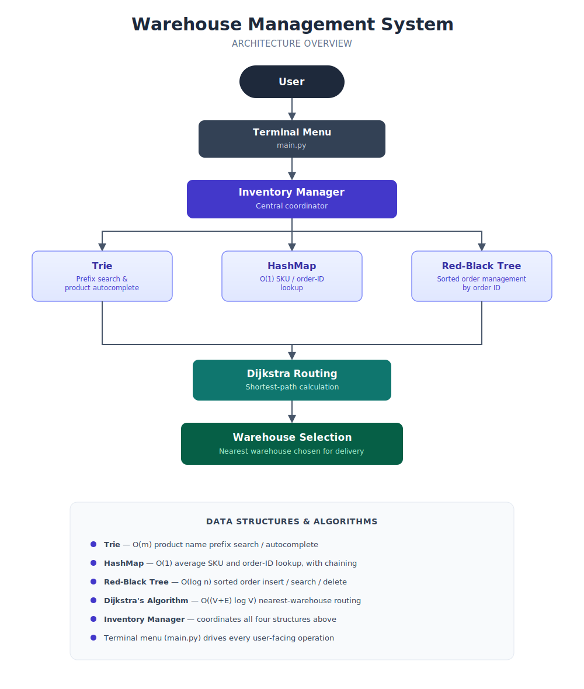

# Warehouse Management System
### Leveraging Advanced Data Structures for Optimized Supply Chain Efficiency

# Project Overview

The **Warehouse Management System** is a terminal-based Python application that demonstrates how advanced **Data Structures and Algorithms (DSA)** can solve real-world inventory and supply chain challenges.

The system manages inventory across multiple warehouses, enables efficient product lookup and search, processes customer purchases, updates stock dynamically, and computes the shortest delivery route for order fulfillment.

Rather than relying on conventional linear data structures, the project integrates specialized structures such as **Red-Black Trees**, **Trie**, **HashMap**, and **Dijkstra's Algorithm** to improve efficiency, scalability, and responsiveness.

This project emphasizes practical applications of DSA concepts commonly used in modern e-commerce and logistics platforms.


# Key Features

- Multi-Warehouse Inventory Management
- Product Catalog Management
- Fast Product Search & Auto-Complete
- SKU-Based Product Lookup
- Dynamic Stock Updates
- Customer Purchase Processing
- Automatic Warehouse Selection
- Shortest Delivery Route Calculation
- Real-Time Inventory Availability
- Interactive Terminal-Based Interface
- Modular Python Implementation


# Technologies Used

- Python 3
- Object-Oriented Programming (OOP)
- Red-Black Tree
- Trie
- HashMap
- Dijkstra's Algorithm
- Heap (Priority Queue)
- Modular Software Design


# Data Structures & Algorithms Used

## 1. Red-Black Tree

The Red-Black Tree stores and manages product records using their SKU as the key. It enables efficient insertion, searching, and stock updates while maintaining a balanced tree structure, ensuring consistent performance even as the inventory grows.

### Operations

- Product Insertion
- SKU Search
- Inventory Updates
- Price Retrieval

**Time Complexity**

| Operation | Complexity |
|-----------|------------|
| Insert | O(log n) |
| Search | O(log n) |
| Update | O(log n) |


## 2. Trie

The Trie indexes product names to support fast prefix-based searching. Instead of scanning every product, the Trie traverses only the characters entered by the user, making product discovery significantly faster for large catalogs.

### Operations

- Prefix Search
- Product Auto-Complete
- Product Suggestions

**Time Complexity**

| Operation | Complexity |
|-----------|------------|
| Search | O(m) |

where **m** is the length of the search prefix.


## 3. HashMap

A custom HashMap is used for constant-time average product retrieval using SKU keys. It simplifies inventory access and supports quick updates without traversing the entire dataset.

### Operations

- Product Lookup
- Inventory Retrieval
- Price Lookup
- Stock Updates

**Average Time Complexity**

| Operation | Complexity |
|-----------|------------|
| Lookup | O(1) |
| Insert | O(1) |
| Update | O(1) |


## 4. Dijkstra's Algorithm

Dijkstra's Algorithm models the warehouse network as a weighted graph and determines the optimal delivery path. It is used to:

- Identify the nearest warehouse capable of fulfilling an order.
- Compute the shortest delivery route.
- Reduce delivery distance across the warehouse network.

**Time Complexity**

**O((V + E) log V)**

where:

- **V** = Number of warehouses
- **E** = Connections between warehouses


# Why These Data Structures?

| Data Structure / Algorithm | Purpose |
|----------------------------|---------|
| **Red-Black Tree** | Maintains balanced inventory records with guaranteed O(log n) operations |
| **Trie** | Enables fast product search and auto-complete using prefixes |
| **HashMap** | Provides constant-time average SKU lookup and inventory access |
| **Dijkstra's Algorithm** | Finds the nearest warehouse and shortest delivery route efficiently |

Together, these data structures enable the system to scale efficiently while maintaining fast search, retrieval, and routing operations that are essential in real-world e-commerce and warehouse management systems.


# Project Structure

```
warehouse-management-system/
│
├── algorithms/
│   └── dijkstra.py                 # Shortest path algorithm
│
├── data/
│   ├── __init__.py
│   └── seed_data.py                # Initial warehouse & product data
│
├── data_structures/
│   ├── hash_map.py                 # Custom HashMap implementation
│   ├── red_black_tree.py           # Red-Black Tree implementation
│   └── trie.py                     # Trie implementation
│
├── src/
│   ├── __init__.py
│   ├── warehouse.py                # Warehouse model
│   ├── inventory_manager.py        # Core inventory operations
│   ├── hash_map.py
│   ├── red_black_tree.py
│   ├── trie.py
│   └── dijkstra.py
│
├── main.py                         # Application entry point
│
└── README.md
```


# System Architecture



# Application Workflow

1. The system initializes warehouse and product data.
2. Products are distributed across multiple warehouses.
3. Users interact with the application through a terminal-based menu.
4. Products can be searched instantly using SKU or product name.
5. Prefix-based autocomplete is available using the Trie.
6. Customer purchases automatically update warehouse inventory.
7. The system checks product availability across warehouses.
8. Dijkstra's Algorithm determines the nearest warehouse capable of fulfilling the order.
9. The shortest delivery path is displayed.
10. Inventory is updated after every successful purchase.


# Menu Options

The application provides an interactive menu allowing users to perform inventory and warehouse operations such as:

```
========================================
        E-Commerce Inventory System
========================================

1. View Available Products

2. Search Product by SKU

3. Search Product by Name

4. Product Auto-Complete

5. Purchase Product

6. View Warehouse Inventory

7. Find Nearest Warehouse

8. Display Shortest Delivery Route

9. Exit
```


# Sample Warehouses

The system initializes multiple warehouses connected through a weighted graph.

| Warehouse |
|------------|
| Coimbatore |
| Ettimadai |
| Chennai |
| Delhi |


# Supported Delivery Locations

Customer deliveries can be routed to locations including:

- Hyderabad
- Mumbai
- Chennai
- Delhi
- Jaipur

The warehouse graph is used to determine the most efficient delivery path.


# Sample Products

The project ships with sample inventory including:

| SKU | Product | Price |
|-----:|----------|------:|
| 101 | SmartPhone | ₹200 |
| 102 | Toothpaste | ₹50 |
| 103 | Calculator | ₹10 |
| 104 | Headphones | ₹200 |
| 105 | ToothBrush | ₹15 |

> During initialization, the application prompts the user to enter stock quantities for each warehouse, allowing the inventory to be customized for every execution.


# How to Run

## Clone the Repository

```bash
git clone https://github.com/PRATYUSH-YADAV-007/warehouse-management-system.git
```

## Navigate to the Project

```bash
cd warehouse-management-system
```

## Run the Application

```bash
python main.py
```

# Time Complexity Summary

| Feature | Data Structure / Algorithm | Time Complexity |
|----------|----------------------------|-----------------|
| Insert Product | Red-Black Tree | **O(log n)** |
| Search Product by SKU | Red-Black Tree | **O(log n)** |
| Update Inventory | Red-Black Tree | **O(log n)** |
| Product Prefix Search | Trie | **O(m)** |
| Product Auto-Complete | Trie | **O(m)** |
| Product Lookup | HashMap | **O(1)** Average |
| Inventory Access | HashMap | **O(1)** Average |
| Shortest Delivery Route | Dijkstra's Algorithm | **O((V+E) log V)** |

> **n** = Number of products  
> **m** = Length of search prefix  
> **V** = Number of warehouses  
> **E** = Connections between warehouses


# Why This Project?

Modern e-commerce platforms must efficiently manage inventory across multiple warehouses while providing fast product discovery and optimized delivery routing. Traditional linear approaches become inefficient as the number of products and warehouses increases.
This project demonstrates how selecting the right Data Structures and Algorithms significantly improves system performance:

- **Red-Black Tree** ensures logarithmic-time inventory operations.
- **Trie** enables fast prefix-based search and auto-complete.
- **HashMap** provides near constant-time product retrieval.
- **Dijkstra's Algorithm** computes the optimal warehouse and delivery route.

# Learning Outcomes

Building this project provided hands-on experience with:

- Practical implementation of self-balancing trees
- Designing and implementing a Trie from scratch
- Developing a custom HashMap
- Applying graph algorithms to real-world routing problems
- Object-Oriented Programming in Python
- Modular software architecture
- Time complexity analysis and optimization
- Applying DSA concepts to solve real-world business problems


# Skills Demonstrated

- Python Programming
- Object-Oriented Programming (OOP)
- Data Structures & Algorithms
- Red-Black Trees
- Trie
- HashMap
- Graph Algorithms
- Dijkstra's Algorithm
- Software Design
- Problem Solving


# Project Highlights

✔ Developed a complete inventory management application from scratch.

✔ Applied multiple advanced Data Structures within a single real-world system.

✔ Demonstrated practical use of graph algorithms for delivery optimization.

✔ Implemented efficient product search and inventory management.

✔ Designed a modular and extensible architecture for future enhancements.


## ⭐ If you found this project interesting, consider giving it a star!

